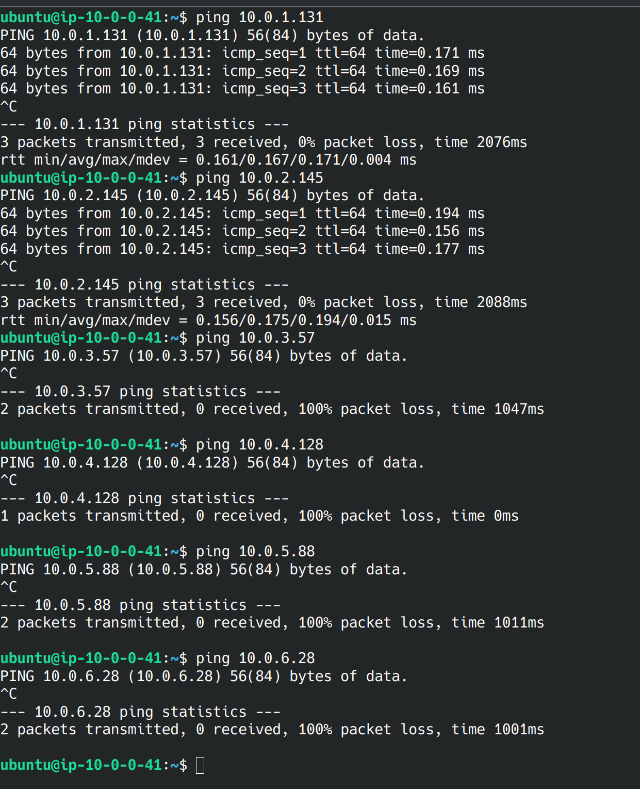

# Networking Task 2

## Create a Tree Topology Using AWS Subnets

### Task:
Build a tree topology by organizing subnets hierarchically.

### Instructions:
# Design a VPC with:
- One main root subnet connected to the internet.
- Two secondary subnets branching from the root.
- At least two tertiary subnets branching from each secondary subnet.
- Deploy EC2 instances in all subnets and configure security groups to allow controlled traffic flow between parent and child subnets.
- Implement a custom NACL or security group rules to simulate parent-to-child and sibling communication.

### Task Details:
- Created a VPC with the CIDR block `10.0.0.0/16` & assigned a root subnet `10.0.0.0/24`.
- Created two secondary subnets (`10.0.1.0/24` & `10.0.2.0/24`) and two subnets for each of the secondary ones (`10.0.3.0/24`, `10.0.4.0/24`, `10.0.5.0/24`, `10.0.6.0/24`).
- Created an EC2 instance for each of the subnets.
- Created network ACLs with the appropriate rules to simulate a tree topology.

### Challenges Faced:
- Had some issues initially understanding the task & spent a longer time setting up the topology.
- Harder to test child networks due to the tree topology setup.

Pings:
 
 
 
 
 
 
 
 
 
 
 
 
Topology:
 
 

