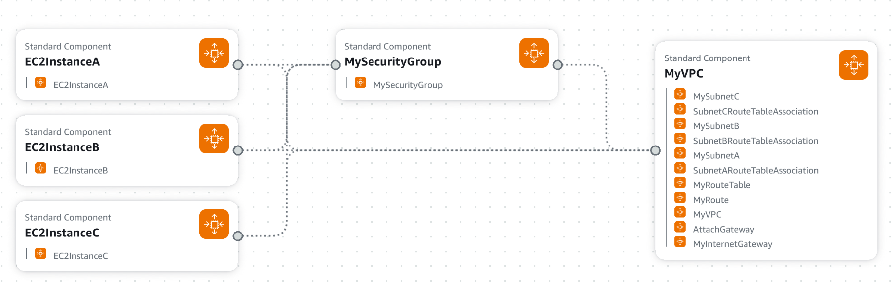

##Build a Star Topology Using AWS VPC
###Task:
 - Create a Virtual Private Cloud (VPC) with a hub-and-spoke (star) topology.
 - Use a central EC2 instance as a router (hub) and multiple other instances (spokes) in different subnets.
###Instructions:
###Design a VPC with:
- One central EC2 instance (hub) in a public subnet.
- At least 3 EC2 instances (spokes) in separate private subnets.
- Configure the central hub to act as a NAT instance for spoke instances.
- Test connectivity by sending pings or transferring files from spoke instances via the hub.
- (Optional) Use AWS Transit Gateway instead of a NAT instance for scalable hub-and-spoke architecture.
###Objective:
- Understand the concepts of star topology.
- Learn about routing and NAT in AWS.

##Implement a Mesh Topology Using Peering Connections
###Task:
- Create a fully connected mesh network using AWS VPC peering between multiple VPCs.
###Instructions:
- Create 3-5 VPCs in different regions or availability zones.
- Establish VPC Peering between each pair of VPCs to form a fully meshed network.
- Launch EC2 instances in each VPC and configure them to communicate with each other.
- Document the routes and changes required in the route tables.
###Objective:
- Explore the concept of mesh topology and inter-VPC communication.
- Learn about VPC peering, route tables, and cross-region networking.

###Result:
###Cloud Formation template and schema:
[cloud_formation_template.json](cloud_formation_template.json)

