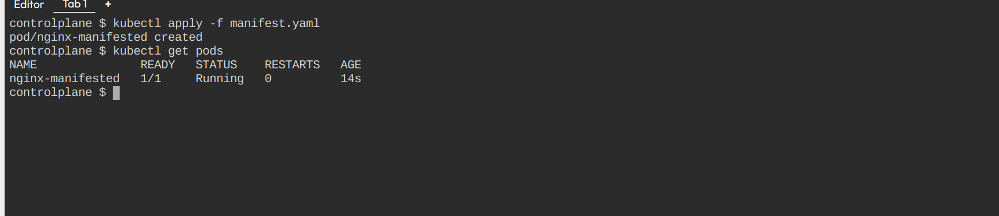
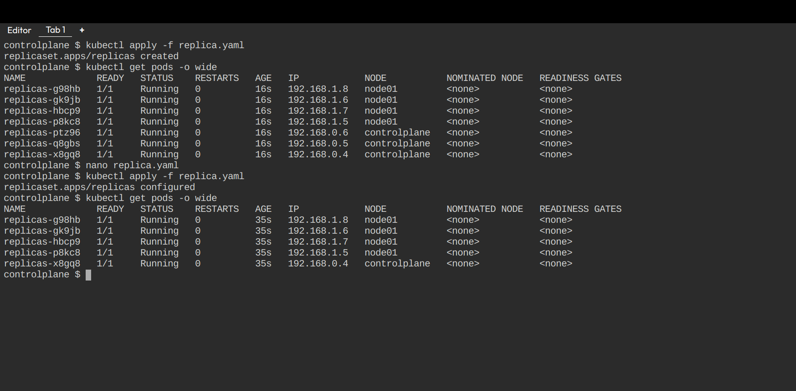
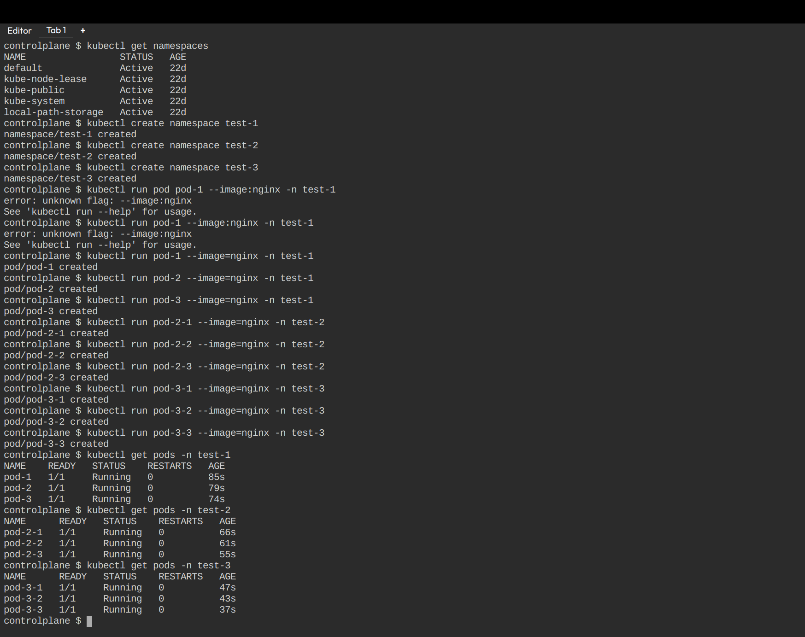

[Link to practice playground](https://killercoda.com/)

## Homework Task - Kubernetes Module

### Create pod using manifest:

### Create deployment with 7 replicas and then scale down replicas to 5:

### Create 3 namespaces, create 2 pods in each namespace:

