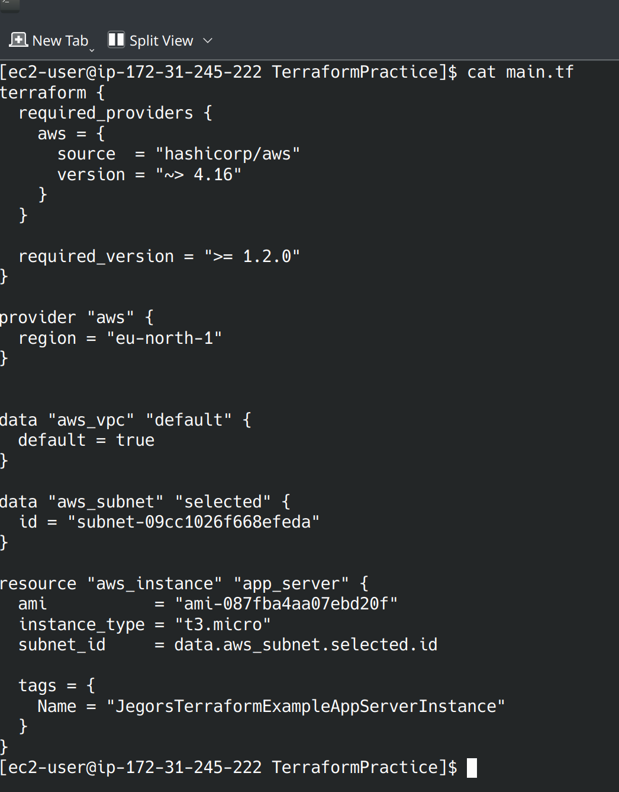
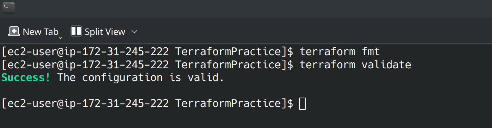
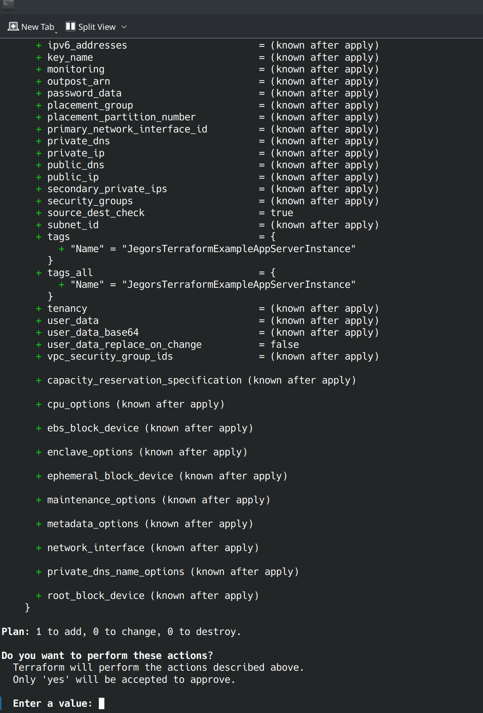
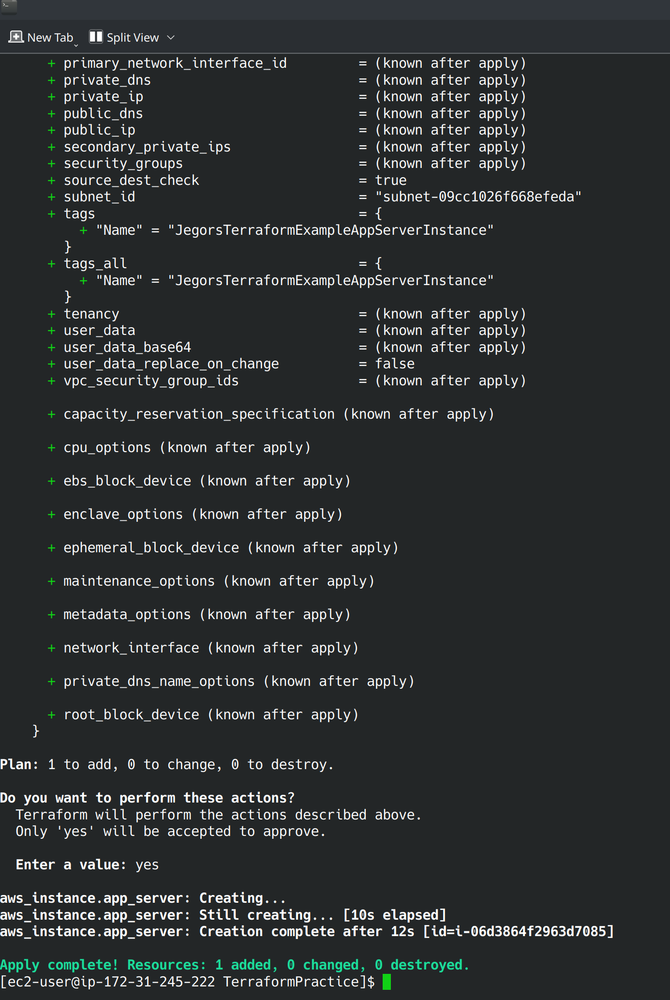
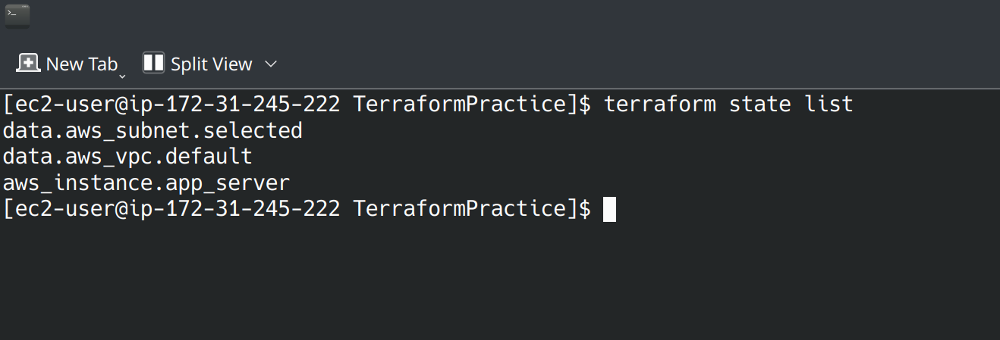
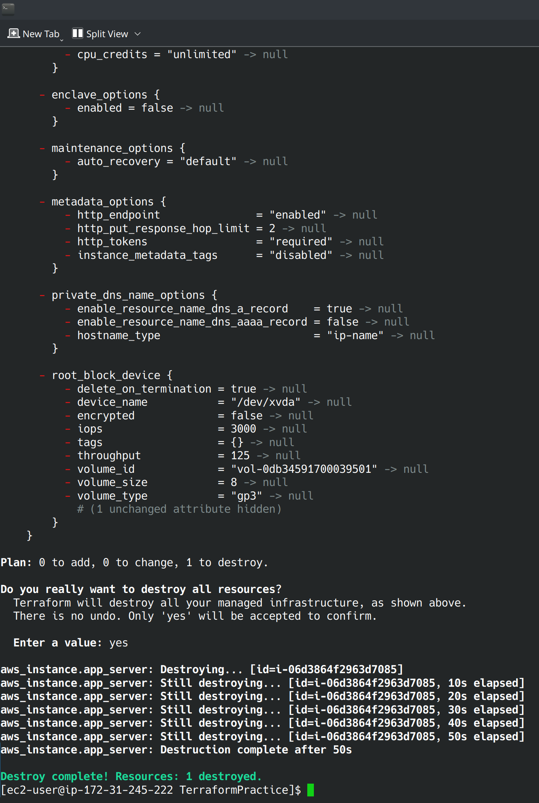

# Terraform Practice in AWS

## Task Description

This repository contains a Terraform configuration to practice creating an EC2 instance in the AWS `eu-north-1` region. The instance will be launched in the default VPC using a specified subnet.

### Objectives

- Set up a Terraform configuration to create an EC2 instance.
- Use the default VPC in the `eu-north-1` region.
- Deploy the instance in the specified subnet: `default_subnet`.
- Output the instance ID after creation.

### Prerequisites

- [Terraform](https://www.terraform.io/downloads.html) installed on your local machine.
- An AWS account with the necessary permissions to create EC2 instances and access VPC resources.
- AWS credentials configured (using `aws configure` or environment variables).

### Configuration

The main Terraform configuration file is named `main.tf`. It includes:

- **Provider Block**: Configures the AWS provider and sets the region to `eu-north-1`.
- **Data Blocks**: Fetches the default VPC and the specified subnet.
- **Resource Block**: Creates an EC2 instance in the specified subnet.
- **Output Block**: Displays the instance ID after the instance is created.

### Results:
 
 
 
 
 
 
